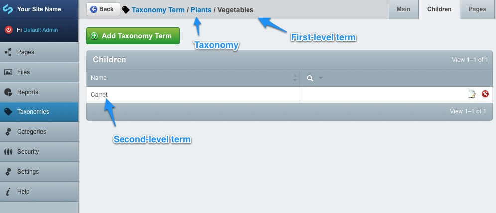
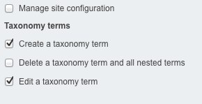

# Creating and using taxonomies

## In this section

- Taxonomy usage
- Taxonomy terms and types
- Taxonomy creation and removal
- Permissions

## Before we begin

- Make sure you have the Silverstripe [taxonomy](http://addons.silverstripe.org/add-ons/silverstripe/taxonomy) module installed

## Taxonomy usage

This module provides a raw skeleton for maintaining taxonomies in the CMS. Taxonomies are used to group content, making it easy to find related pieces of information. By default, the module provides the interface described below to create and manage taxonomies, using Taxonomy Terms and Taxonomy Types.

### Taxonomy terms and types

The Taxonomy Term is the equivalent of the taxonomy itself - it serves to provide it's name, and as a holder of all the taxonomy's types. For example, a taxonomy term called 'News' could have multiple taxonomy types such as 'National', 'International', and 'Sport'. These help make your content easier to find by refining the focus.

### Taxonomy creation

To create a taxonomy, navigate to the "Taxonomies" section.

The list that appears contains all existing taxonomies - there could be many in parallel. If the list is empty, you will want to create a Taxonomy Type first. To do so, navigate to the "Taxonomy Types" tab, click "Add new Taxonomy Type", specify the name (e.g. "News") and click "Create".

To create first layer of terms within the taxonomy, switch to the "Taxonomy Terms" tab. Click "Add new Taxonomy Term" and this time create "National". Switch to the "Children" tab, and nest another term underneath: (e.g. "Weather"). You have just
created a three-level hierarchy of "News > National > Weather".

You can easily navigate around the hierarchy by using breadcrumbs at the top as you would with other areas in
Silverstripe CMS.

### Taxonomy removal

The taxonomies can be recursively removed. To remove an entire taxonomy, you can click the button "More options" which is shown as an ellipses icon and choose "Delete". All terms belonging to it will be removed.

You can also remove parts of the taxonomy tree - just descend into the children terms, and use the "More options" button next to
the top-level item of the subtree to be removed.

## Permissions

Site administrator can specify permissions around taxonomies. There are three permissions that can be set on groups:

- "Create a taxonomy term": allows adding new terms to existing taxonomies.
- "Delete a taxonomy term and all nested terms": allows to delete items recursively.
- "Edit a taxonomy term": allows members of the group to update the taxonomy details.
